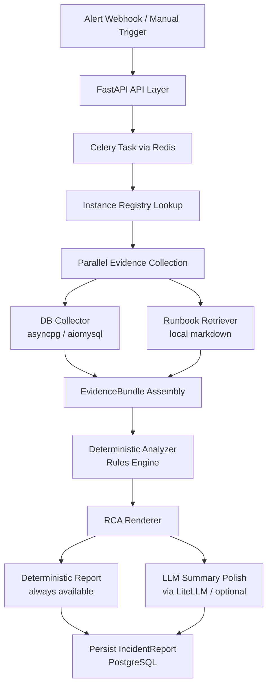

# SentinelDB - DBE Incident Analysis Assistant


SentinelDB is a read-only DB incident analysis assistant for MySQL and PostgreSQL. Built with an evidence-first architecture, it gathers metrics from databases, monitoring systems (CloudWatch, PMM), and runbooks to produce a concise, safe, and structured Root Cause Analysis (RCA) report. It is designed to never write to monitored databases or execute arbitrary AI-generated SQL, ensuring complete read-only safety for production environments.

## Architecture



## Tech Stack

| Layer | Technology |
|---|---|
| **Language** | Python 3.12 |
| **API** | FastAPI |
| **Task Queue** | Celery + Redis |
| **Persistence** | PostgreSQL + SQLAlchemy 2.0 (async) + Alembic |
| **DB Drivers** | `asyncpg` (PG), `aiomysql` (MySQL) |
| **Validation** | Pydantic v2 |
| **LLM Access** | LiteLLM (Gemini 2.5 Flash-Lite) |
| **Safety** | `sqlparse` + strict allowlist |
| **Tooling** | `uv`, `pytest`, `ruff`, Docker Compose |

## Key Design Decisions

- **Evidence-First, LLM-Second:** Deterministic collectors and rules build the evidence bundle and candidate causes. The LLM is strictly confined to summarizing the selected cause, preventing metric hallucination.
- **Read-Only by Design:** Application-level guardrails (`sqlparse`) paired with least-privilege database users guarantee zero DML/DDL execution.
- **Production-Grade Async:** Built on Celery + Redis to provide durable incident processing and horizontal scaling from day one.
- **Provider-Agnostic AI:** Uses `LiteLLM` to abstract provider SDKs, enabling easy pivots and local fallbacks without code changes.

## Development Setup

1. **Install uv:**
   ```bash
   curl -LsSf https://astral.sh/uv/install.sh | sh
   ```
2. **Install Dependencies:**
   ```bash
   uv sync --all-extras
   ```
3. **Setup Environment:**
   Copy `.env.example` to `.env` and fill in any required keys.
4. **Start Infrastructure:**
   ```bash
   docker compose up -d
   ```
5. **Run Checks:**
   ```bash
   uv run pytest
   uv run ruff check .
   uv run ruff format --check .
   ```

## Documentation Index

- `docs/PRD.md` - Product requirements and scope
- `docs/ARCHITECTURE.md` - Detailed system architecture and module tree
- `docs/DECISIONS.md` - Architecture decision records (ADRs)
- `AGENTS.md` - Shared project rules for agentic AI tools (Antigravity/Claude Code)
- `CLAUDE.md` - Claude Code specific workflows
- `.claude/rules/` - Modular agent rules for guardrails and testing
- `docs/brainstorms/` - Product ideation and technical requirements
- `docs/plans/` - Implementation plans generated by `ce-plan`
- `runbooks/` - Sample markdown runbooks for retrieval and testing
