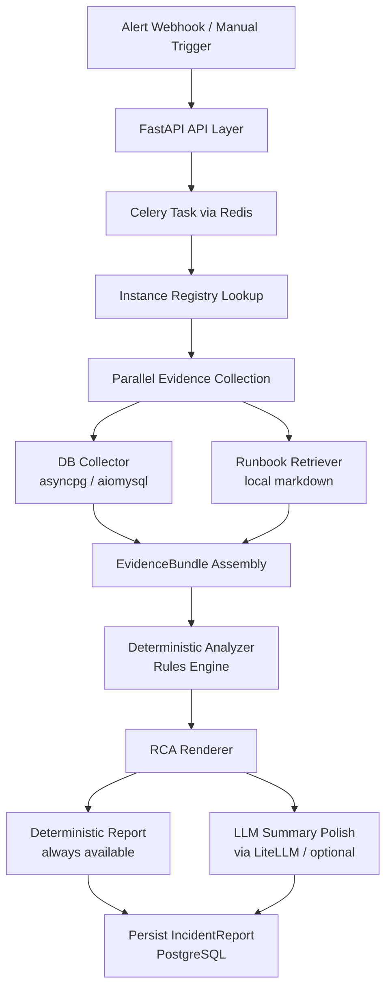

# SentinelDB Architecture

## System Summary
SentinelDB is a read-only incident analysis assistant for MySQL/PostgreSQL alerts. It receives alerts, resolves the affected instance, gathers evidence from safe collectors, analyzes likely root causes using deterministic rules, and renders a concise RCA report for DBEs.

## V1 Architecture



> **Note:** CloudWatch, PMM/Prometheus collectors, and notification dispatch (Slack/Teams, Jira) are deferred to V1B.

## Core Modules Planned

```text
src/sentineldb/
  core/
    config.py              # Pydantic BaseSettings
    models.py              # Pydantic domain models
    enums.py               # AlertType, Severity, EvidenceStatus, etc.
  guardrails/
    checker.py             # SQL/action safety checks
    catalog.py             # Approved diagnostic query/action catalog
  registry/
    loader.py              # YAML instance registry loader
    models.py              # InstanceConfig models
  collectors/
    postgres.py            # PostgreSQL read-only collector
    mysql.py               # MySQL read-only collector
    cloudwatch.py          # AWS CloudWatch collector (V1B)
    prometheus.py          # PMM/Prometheus collector (V1B)
  analysis/
    rules.py               # Candidate cause rules
    renderer.py            # RCA output renderer
  llm/
    summarizer.py          # LiteLLM summarization polish
  api/
    main.py                # FastAPI app
    routes_alerts.py       # Alert webhook
  worker/
    app.py                 # Celery app configuration
    tasks.py               # Celery async tasks
  db/
    session.py             # SQLAlchemy async engine/session
    models.py              # SQLAlchemy ORM models
  integrations/
    slack.py               # Slack/Teams (V1B)
    jira.py                # Jira (V1B)
```

## Tech Stack

| Layer | Technology | Rationale |
|---|---|---|
| Language | Python 3.12 | PRD requirement |
| Package manager | uv | Fast, modern, already in use |
| API framework | FastAPI | Async, webhook-friendly, modern |
| Task queue | Celery + Redis | Production-grade async processing |
| App persistence | PostgreSQL 16 in Docker | Standard, Supabase-compatible for later |
| ORM / migrations | SQLAlchemy 2.0 + Alembic | Async-native, mature migration support |
| Validation | Pydantic v2 | Models, settings, API contracts |
| Target DB drivers | asyncpg (PG), aiomysql (MySQL) | Async read-only collectors |
| HTTP client | httpx | Async for monitoring APIs |
| AWS SDK | boto3 | CloudWatch and RDS read-only APIs |
| SQL safety | sqlparse + allowlist catalog | Guardrail enforcement |
| LLM abstraction | LiteLLM | Provider-agnostic LLM calls |
| LLM primary | Gemini 2.5 Flash-Lite | Best free tier, cheapest paid |
| Frontend | React + Vite (V1C) | Deferred until pipeline is stable |
| Tests | pytest + pytest-asyncio | Unit and integration testing |
| Lint / format | ruff | Single tool for both |
| Containers | Docker + Docker Compose | Local dev and future deployment |

## Infrastructure

- **Local Development:** All services (FastAPI application, Celery worker, Redis broker, and PostgreSQL database) are orchestrated via Docker Compose for a contained local environment.
- **Deployment Path:** The application is designed to be deployed to Supabase. The database schema uses standard PostgreSQL features exclusively, without vendor-specific extensions, so it can be deployed to a standard Supabase instance without modifying the application code.

## Evidence-First RCA Contract
The RCA report must be generated from structured evidence:

1. `ROOT CAUSE`: 1-3 lines.
2. `WHY THIS IS MOST LIKELY`: 2-4 bullets.
3. `EVIDENCE`: source-tagged proof bullets.
4. `RUNBOOK`: matched runbook, if strong enough.
5. `SAFE NEXT ACTIONS`: approved read-only checks only.
6. `REQUIRES DBE APPROVAL`: risky actions.
7. `EVIDENCE STATUS`: collected and missing data.
8. `RCA strength`: High/Medium/Low.

## Safety Boundary
LLMs are not allowed to:
- invent metrics,
- generate executable SQL (all SQL is parsed via `sqlparse` and checked against an allowlist catalog),
- classify unsafe actions as safe,
- hide missing evidence,
- produce long narrative RCA reports.
