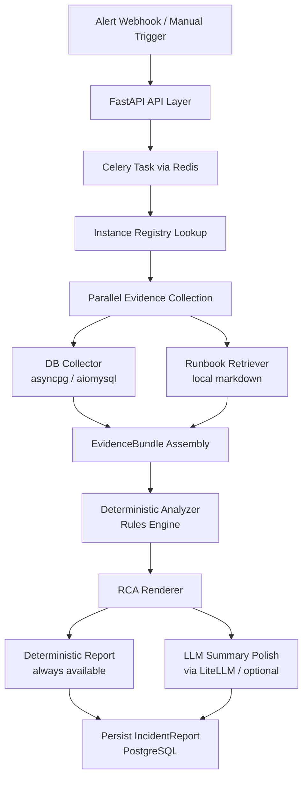

# SentinelDB Tech Stack, LLM Provider, and System Design

## Summary

Tech stack, LLM provider, and system design decisions for SentinelDB V1. Establishes a production-grade foundation with Celery + Redis for async processing, LiteLLM + Gemini 2.5 Flash-Lite for provider-agnostic LLM summarization, PostgreSQL for local development with a Supabase deployment path, and a deterministic evidence-first pipeline with clean interfaces for future LangGraph evolution.

---

## Problem Frame

The PRD (`PRD.md`) defines SentinelDB's functional requirements and acceptance criteria but defers several tech decisions: which LLM provider and model to use, which worker architecture to adopt, how to handle deployment portability, and how to structure the data flow for future extensibility. These decisions must be resolved before implementation planning can produce concrete implementation units.

---

## Key Decisions

**Layered Production Foundation over minimal-then-evolve.** Celery + Redis from day 1 instead of FastAPI BackgroundTasks + a job table. The project is a portfolio piece demonstrating production system design; starting with production-grade async processing avoids refactoring later and shows real-world architecture to evaluators.

**LLM is summarization-only.** The deterministic pipeline (collectors → analyzer → renderer) always runs first and produces a complete report. The LLM only compresses the selected candidate cause into a concise root cause summary (1-3 sentences). If the LLM is unavailable, the deterministic fallback report ships unchanged.

**Supabase as deployment target, not in-code dependency.** The codebase uses standard PostgreSQL connections (SQLAlchemy + asyncpg) throughout. No Supabase client library, no Supabase-specific APIs. The schema uses only standard PostgreSQL features so it deploys to Supabase without modification when moving to cloud hosting.

**LangGraph deferred to V2.** The V1 pipeline is deterministic and linear — it doesn't branch, loop, or require human-in-the-loop steps. LangGraph adds value when the analysis pipeline needs conditional branching or retry logic. V1 interfaces (collector → analyzer → renderer) are kept simple and linear; LangGraph wrapping is a V2 concern, not a V1 design constraint.

**Gemini 2.5 Flash-Lite as primary LLM.** Cheapest option with a free tier ($0.10/1M input, $0.40/1M output). Includes hybrid reasoning. Sufficient for constrained summarization of structured evidence. Gemini 2.0 Flash was deprecated and shut down June 1, 2026.

**LiteLLM as LLM abstraction.** Provider-agnostic interface — provides automatic retries, token counting, and easy switching to other providers in V2.

---

## Requirements

**Core Architecture**

R1. Use Celery + Redis as the task queue for async incident analysis processing.

R2. Use plain PostgreSQL 16 in Docker for local development. Design the schema with standard PostgreSQL features only — no vendor-specific extensions — so it deploys to Supabase without modification. When targeting Supabase's connection pooler, disable asyncpg prepared statement caching (`prepared_statement_cache_size=0`).

R3. Use FastAPI for the API layer, handling alert webhooks and dashboard API endpoints.

R4. Use SQLAlchemy 2.0 (async mode) and Alembic for ORM and database migrations.

**LLM Integration**

R5. Use LiteLLM as the LLM abstraction layer for provider-agnostic access, preparing for multi-provider support in V2.

R6. Use Gemini 2.5 Flash-Lite via Google AI Studio as the sole LLM provider for V1.

R9. The LLM receives only a structured evidence summary as input and produces only a concise root cause summary (1-3 sentences) as output. Evidence values in the RCA report must come from collectors, never the LLM.

R10. The system must produce a complete, usable RCA report without any LLM availability. LLM summarization is optional polish, not a dependency.

**Data Flow**

R11. The V1A incident analysis pipeline follows this sequence: alert ingestion → Celery task dispatch → instance registry resolution → parallel evidence collection (DB collector + runbook retriever) → evidence bundle assembly → deterministic analysis → RCA rendering → report persistence. Notification dispatch (Slack, Jira) is deferred to V1B.

R12. Evidence collection runs as concurrent async tasks (`asyncio.gather`) within a single Celery worker task — not as parallel Celery subtasks — with per-source timeouts. Partial results from available sources are assembled into the evidence bundle even when some sources fail. Celery workers must run an async event loop (e.g. via `asyncio.run` in the task body or a pool configured for async) to support asyncpg, aiomysql, and httpx collectors.

R13. The analysis pipeline uses clean, interface-based boundaries between collectors, analyzer, and renderer. Interfaces must be simple and linear — no speculative accommodation for future LangGraph wrapping or conditional branching.

**Redis Security**

R14. The Redis broker must be configured with authentication (password or ACL) in all environments. Celery task serialization must use JSON (`task_serializer = "json"`, `result_serializer = "json"`) — pickle serialization is prohibited. Redis must not be exposed on a public network interface.

**Webhook and API Security**

R15. FastAPI webhook endpoints must validate incoming request signatures (e.g. HMAC-SHA256 shared secret) before dispatching Celery tasks. All internal API endpoints must require authentication (e.g. API key or bearer token via `pydantic-settings`).

**Credential Management**

R16. Credentials for monitored databases and AWS must be stored as encrypted secrets, never in plaintext config files or committed to version control. In local development, credentials are loaded from `.env` (gitignored). Production deployment uses environment-injected secrets (e.g. Supabase secrets management or Docker secrets).

**LLM Evidence Privacy**

R17. Before sending evidence to an external LLM provider (Gemini, Groq), the evidence summary must be scrubbed of PII and sensitive values (hostnames, usernames, query literals, IP addresses). Scrubbing replaces sensitive tokens with anonymized placeholders (e.g. `<host>`, `<query>`). Locally-run Ollama is exempt from this requirement.

**Runbook Retrieval**

R28. The pipeline includes a runbook retriever that fetches relevant runbook content from local markdown files (in `runbooks/`) based on the incident type. Retrieved runbook content is included in the evidence bundle as advisory context for the renderer.

**Instance Registry**

R29. A local instance registry stores metadata for each monitored database instance: connection parameters (host, port, database name, driver type), read-only credential references, and instance labels. The registry is loaded from a local config file (e.g. `instances.yaml`) at startup. The Celery task resolves the target instance from the registry using the alert's instance identifier before dispatching collectors.

**Development Infrastructure**

R18. Docker Compose orchestrates all local services: FastAPI application, Celery worker, Redis broker, and PostgreSQL database.

R19. Use uv for Python dependency and environment management.

R20. Use Pydantic v2 for all domain models, configuration, and API request/response contracts.

R21. Use ruff as the single tool for both linting and formatting.

R22. Use pytest and pytest-asyncio for unit and integration testing.

**Target Database Connectivity**

R23. Use asyncpg for read-only PostgreSQL collector connections to monitored databases.

R24. Use aiomysql for read-only MySQL collector connections to monitored databases.

R25. Use httpx for async HTTP calls to PMM/Prometheus endpoints and other monitoring APIs. (V1B — deferred until local DB collector pipeline passes tests.)

R26. Use boto3 for AWS CloudWatch and RDS read-only API access. (V1B — deferred until local DB collector pipeline passes tests.)

**Safety**

R27. Use sqlparse combined with an allowlist-based diagnostic query catalog for SQL guardrail enforcement. The LLM must not generate executable SQL.

---

## System Design

> **V1A scope:** CloudWatch, PMM/Prometheus collectors and notification dispatch (Slack/Teams, Jira) are intentionally omitted from this diagram. They appear in Scope Boundaries → Deferred to V1B.

---

## Tech Stack

| Layer | Technology | Rationale |
|---|---|---|
| Language | Python 3.12 | PRD requirement |
| Package manager | uv | Fast, modern, already in use |
| API framework | FastAPI | Async, webhook-friendly, modern |
| Task queue | Celery + Redis | Production-grade async processing |
| App persistence | PostgreSQL 16 in Docker | Standard, Supabase-compatible for later |
| ORM / migrations | SQLAlchemy 2.0 + Alembic | Async-native, mature migration support |
| Validation | Pydantic v2 | Models, settings, API contracts |
| Target DB drivers | asyncpg (PG), aiomysql (MySQL) | Async read-only collectors |
| HTTP client | httpx | Async for monitoring APIs |
| AWS SDK | boto3 | CloudWatch and RDS read-only APIs |
| SQL safety | sqlparse + allowlist catalog | Guardrail enforcement |
| LLM abstraction | LiteLLM | Provider-agnostic LLM calls |
| LLM primary | Gemini 2.5 Flash-Lite | Best free tier, cheapest paid |
| Frontend | React + Vite (V1C) | Deferred until pipeline is stable |
| Tests | pytest + pytest-asyncio | Unit and integration testing |
| Lint / format | ruff | Single tool for both |
| Containers | Docker + Docker Compose | Local dev and future deployment |

---

## Scope Boundaries

### Deferred to V1B

- CloudWatch Collector (boto3) — AWS metrics integration
- PMM/Prometheus Collector (httpx) — external monitoring API integration
- Slack/Teams notification dispatch
- Jira ticket creation integration

### Deferred to V1C

- React + Vite frontend dashboard
- Supabase-specific features: auth, real-time subscriptions, storage

### Deferred to V2

- LangGraph agent orchestration for the analysis pipeline
- Advanced LLM reasoning beyond root cause summarization
- Support for local inference via Ollama (e.g., Llama 3.2 3B) and alternative cloud providers like Groq
- Multi-provider LLM fallback chains with automatic failover
- Gemini 2.5 Flash or 3.5 Flash upgrade for complex reasoning tasks

### Out of Scope

- Supabase client library or Supabase-specific APIs in application code
- Multi-tenancy and tenant isolation
- SaaS features: billing, onboarding, customer-facing settings
- Fine-tuned or custom-trained LLM models
- LLM-generated executable SQL

---

## Dependencies and Assumptions

- Google AI Studio free tier remains available with current rate limits (~15 RPM, ~1,500 requests/day for Flash-Lite).
- LiteLLM supports Gemini through its unified completion interface, ready for other providers in V2.
- Redis is acceptable additional infrastructure for the local Docker Compose stack.
- Supabase accepts standard PostgreSQL schemas without modification when migrating from plain PostgreSQL.

---

## Sources

- [Google AI pricing and model comparison](https://ai.google.dev/pricing) — Gemini 2.0 Flash deprecated June 1, 2026; 2.5 Flash-Lite is the cost-optimized active model.
- `PRD.md` — functional requirements, acceptance criteria, architecture overview, and open questions this document resolves.
- `ARCHITECTURE.md` — V1A/V1B/V1C architecture progression and module layout.
