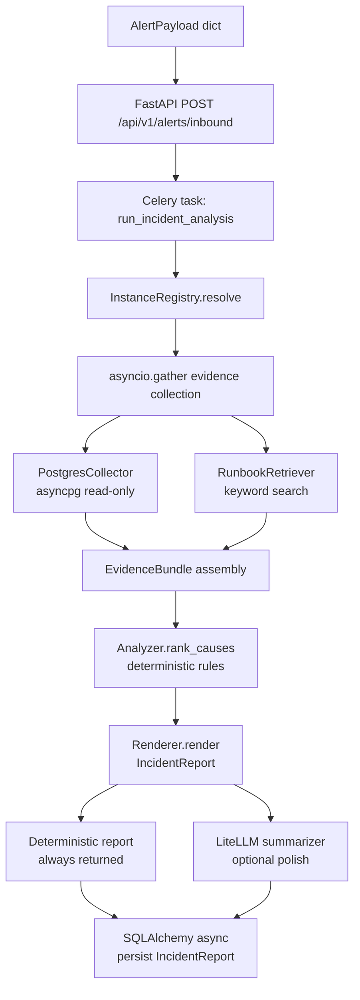
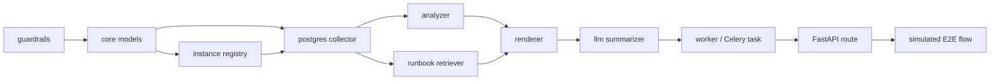
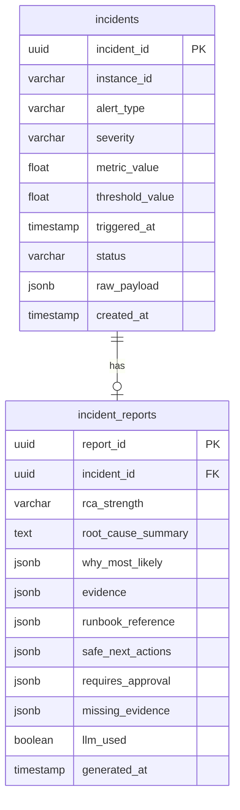

# feat: SentinelDB V1A Foundation — Guardrails, Models, Collector, RCA Pipeline, Simulated Flow

## Summary

Implement the complete V1A foundation: guardrail checker, core Pydantic models, instance registry, PostgreSQL collector, runbook retriever, deterministic RCA analyzer and renderer, LiteLLM summarizer (API-key-optional with non-LLM fallback), and a simulated alert-to-report flow wired through the full Celery + SQLAlchemy + Docker stack. All units have tests; guardrail and RCA units follow a test-first posture.

---

## Problem Frame

The repo has project structure, docs, and infrastructure scaffolding (Docker Compose, Dockerfile, pyproject.toml) but no application code. V1A must produce a complete, safe, evidence-backed RCA report from a simulated alert — proving the core pipeline before any external integrations (CloudWatch, PMM, Slack, Jira) are added. This is the mandatory proof-of-life gate before V1B.

---

## Requirements

**Guardrails**

- R1. A `GuardrailChecker` blocks all DML, DDL, GRANT/REVOKE, SET GLOBAL, multi-statement strings, mixed-case bypass, and comment-based bypass attempts against the diagnostic catalog.
- R2. Celery task serialization uses JSON only (`task_serializer="json"`, `result_serializer="json"`). Pickle is prohibited.
- R3. The LLM must not generate executable SQL. Any SQL shown to users must pass guardrail checks first.

**Core Models**

- R4. Pydantic v2 models cover `AlertPayload`, `InstanceConfig`, `EvidenceItem`, `EvidenceBundle`, `CandidateCause`, `IncidentReport`, `SafeAction`, `RunbookMatch`, and supporting enums (`AlertType`, `Severity`, `EvidenceStatus`, `IncidentStatus`). (see origin: `docs/brainstorms/2026-06-27-sentineldb-tech-stack-system-design-requirements.md`)
- R5. SQLAlchemy 2.0 async ORM models cover the `incidents` and `incident_reports` tables. Schema uses standard PostgreSQL features only — no vendor-specific extensions.
- R6. Alembic initial migration creates the schema. `prepared_statement_cache_size=0` is set on the asyncpg engine for Supabase connection pooler compatibility.

**Instance Registry**

- R7. An `instances.yaml` loader resolves an `instance_id` to a full `InstanceConfig`. A missing entry raises `InstanceNotRegistered` — no analysis is attempted.
- R8. The registry ships with a demo entry (`db-demo-01`) pointing at the Docker Compose PostgreSQL service.

**PostgreSQL Collector**

- R9. The collector runs approved read-only queries from the diagnostic catalog: `pg_stat_activity`, `pg_stat_database`, `pg_stat_replication`, connection counts, and `pg_stat_statements` (when available).
- R10. Each evidence item carries: source, label, value, unit, timestamp, status, raw_reference, display_text. Unavailable metrics are represented as `UNAVAILABLE`, never omitted.
- R11. Evidence collection runs with per-query timeouts via `asyncio.gather`. Partial results are assembled even when some queries fail.
- R12. The Celery worker runs an async event loop (`asyncio.run` in the task body) to support asyncpg.

**Runbook Retriever**

- R13. The retriever keyword-searches markdown files under `runbooks/` and returns the top match above a relevance threshold. Below threshold it returns `None` (not a weak match surfaced as authoritative).
- R14. At least three demo runbooks are present: high CPU / connection saturation, slow query spike, DB unreachable.

**RCA Analyzer**

- R15. The analyzer applies deterministic rules over the `EvidenceBundle` and returns a ranked list of `CandidateCause` objects. V1A rules cover: connection saturation, slow query CPU pressure, replication lag, DB unreachable.
- R16. `RCA strength` is computed by rules (High / Medium / Low), not by LLM. High requires a primary signal plus at least one corroborating signal with key alternatives ruled out.

**RCA Renderer**

- R17. The renderer produces a complete `IncidentReport` from a `CandidateCause` and `EvidenceBundle` — deterministic path always available, no LLM dependency.
- R18. The rendered report follows the RCA output contract: ROOT CAUSE (1-3 lines), WHY THIS IS MOST LIKELY (2-4 bullets), EVIDENCE (source-tagged), RUNBOOK match, SAFE NEXT ACTIONS (approved checks only), REQUIRES DBE APPROVAL, EVIDENCE STATUS, RCA strength label.
- R19. Evidence values in the report match collected data exactly — never LLM-generated text.

**LLM Summarizer**

- R20. The LiteLLM summarizer accepts a `CandidateCause` summary and returns a polished 1-3 sentence root cause string, or `None` when no API key is configured or the call fails.
- R21. The summarizer scrubs PII and sensitive values (hostnames, usernames, query literals, IP addresses) before sending to Gemini. Scrubbing replaces tokens with anonymized placeholders (`<host>`, `<query>`).
- R22. The non-LLM fallback report is complete and usable. LLM output replaces only the root cause summary sentence — all other fields are deterministic.

**Celery + API Wiring**

- R23. A Celery task `run_incident_analysis` accepts an `incident_id` and an `AlertPayload` dict, runs the full collector → analyzer → renderer pipeline, and persists the `IncidentReport` to PostgreSQL.
- R24. A FastAPI route `POST /api/v1/alerts/inbound` validates the payload, creates an incident record, and dispatches the Celery task. Webhook signature validation (HMAC-SHA256) is enforced before dispatch.
- R25. Redis is configured with auth (password from env). The REDIS_URL in `.env.example` includes the password slot.
- R26. Credentials are loaded exclusively from environment variables via `pydantic-settings`. No secrets in committed code.

**Simulated Flow**

- R27. A CLI script or pytest integration test drives a complete simulated incident: demo alert payload → instance registry lookup → PostgreSQL collector against Docker DB → evidence bundle → analyzer → renderer → persisted report. The test passes without an LLM API key (LLM path stubbed or skipped).
- R28. The full stack (FastAPI + Celery + Redis + PostgreSQL) runs via `docker compose up`. The simulated flow test passes against the running stack.

**Testing**

- R29. Guardrail unit tests cover: DML variants, DDL variants, GRANT/REVOKE, SET GLOBAL, multi-statement, mixed case, SQL comment bypass, semicolon chaining, CTEs, and stored procedure calls.
- R30. RCA golden tests cover: high CPU + connection saturation, slow query spike, replication lag, DB unreachable, missing evidence (partial collector failure).
- R31. `uv run pytest`, `uv run ruff check .`, and `uv run ruff format --check .` all pass cleanly.

---

## High-Level Technical Design

### Pipeline data flow



### Module dependency order (sequencing constraint)



### ORM schema (SentinelDB's own persistence)



---

## Output Structure

```text
src/sentineldb/
  core/
    config.py              # Pydantic BaseSettings (env vars)
    models.py              # All domain Pydantic models
    enums.py               # AlertType, Severity, EvidenceStatus, IncidentStatus
  guardrails/
    checker.py             # GuardrailChecker — allowlist + sqlparse
    catalog.py             # Approved diagnostic query/action catalog
  registry/
    loader.py              # YAML instance registry loader
    models.py              # InstanceConfig only (CloudResourceConfig, MonitoringConfig deferred to V1B)
  collectors/
    postgres.py            # PostgreSQL read-only collector (asyncpg)
  analysis/
    rules.py               # Deterministic CandidateCause rules
    renderer.py            # IncidentReport renderer
    runbook_retriever.py   # Keyword-based runbook search
  llm/
    summarizer.py          # LiteLLM summarization with PII scrub + fallback
  api/
    main.py                # FastAPI app factory
    routes_alerts.py       # POST /api/v1/alerts/inbound
  worker/
    app.py                 # Celery app configuration (JSON serialization, Redis auth)
    tasks.py               # run_incident_analysis Celery task
  db/
    session.py             # SQLAlchemy async engine + session factory
    models.py              # ORM: incidents, incident_reports tables

tests/
  test_guardrails.py       # Unit — GuardrailChecker all blocked cases
  test_catalog.py          # Unit — query catalog validation
  test_models.py           # Unit — Pydantic model validation and serialization
  test_registry.py         # Unit — registry loader and InstanceNotRegistered
  test_collector_postgres.py  # Integration — collector against Docker PostgreSQL
  test_runbook_retriever.py   # Unit — keyword search, threshold behavior
  test_analyzer.py         # Unit — deterministic RCA rules, golden scenarios
  test_renderer.py         # Unit — IncidentReport output contract
  test_summarizer.py       # Unit — LLM path (mocked), fallback path, PII scrub
  test_e2e_simulated.py    # Integration — full stack simulated incident flow

instances.yaml             # Demo instance registry (db-demo-01 → Docker PG)
runbooks/
  high_cpu_connection_saturation.md
  slow_query_spike.md
  db_unreachable.md
alembic/
  env.py
  versions/
    0001_initial_schema.py
alembic.ini
```

---

## Key Technical Decisions

- **Full Celery + SQLAlchemy stack in V1A, not a pure Python stub:** Docker Desktop is available; the simulated flow test runs against the full stack. This demonstrates production architecture from the first commit. (see origin: `docs/brainstorms/2026-06-27-sentineldb-tech-stack-system-design-requirements.md`, ADR-004)

- **PostgreSQL as the first collector:** More diagnostic system views available than MySQL, consistent with the PRD's preferred path, and the `db-demo-01` Docker Compose service is already PostgreSQL. MySQL collector deferred to V1B. (see origin: PRD open question #1)

- **asyncio.gather within a single Celery task, not parallel Celery subtasks:** Per-source timeouts via `asyncio.wait_for`. The Celery task body calls `asyncio.run(...)` to host the async coroutines. (see origin: R12)

- **Guardrail checker is allowlist-first, sqlparse-second:** The catalog holds approved query fingerprints. Any SQL not on the allowlist is rejected before sqlparse runs. sqlparse provides a second check for bypass patterns (comments, multi-statement, mixed case) against any SQL that does reach an execution path.

- **LiteLLM summarizer is wired but API-key-optional:** When `GOOGLE_API_KEY` is absent or the call fails, the summarizer returns `None` and the renderer uses the deterministic root cause string unchanged. The test suite stubs the LiteLLM call so no real API key is required for `uv run pytest`.

- **PII scrub before any external LLM call:** A regex-based scrubber replaces hostnames, usernames, query literals, and IP addresses with `<host>`, `<user>`, `<query>`, `<ip>` before the evidence summary is sent to Gemini. (see origin: R17)

- **Alembic `env.py` uses a sync driver for migrations:** `asyncpg` URL is used for the runtime async engine. For Alembic migration runs (which are synchronous), `env.py` swaps to a sync connection — either via `psycopg2`-formatted URL or SQLAlchemy's `run_sync` on the async connection. Note: `psycopg2-binary` must be added as a dev dependency if not already present.

- **HMAC-SHA256 webhook signature validation on the alert endpoint:** `WEBHOOK_SECRET` loaded from env. If absent in development, validation is skipped with a warning — not silently bypassed in production.

- **Redis password required:** `REDIS_URL` must include auth (e.g., `redis://:password@localhost:6379/0`). The Celery app raises on startup if the URL has no password in non-development mode.

---

## Implementation Units

### U1. Guardrails — `GuardrailChecker` and diagnostic catalog

**Goal:** Allowlist-first SQL safety checker with full test coverage of all blocked patterns.

**Requirements:** R1, R3, R29

**Dependencies:** none

**Files:**
- `src/sentineldb/guardrails/checker.py`
- `src/sentineldb/guardrails/catalog.py`
- `tests/test_guardrails.py`
- `tests/test_catalog.py`

**Approach:** `catalog.py` holds a `DIAGNOSTIC_CATALOG` dict mapping query name → approved SQL template. `checker.py` exposes `GuardrailChecker.check(sql: str) -> GuardrailResult`. It first checks if the SQL matches a catalog entry. If not, it parses with `sqlparse` and checks for blocked statement types (DML, DDL, GRANT, REVOKE, SET GLOBAL, CALL) and structural bypass patterns (multi-statement via semicolons, SQL comments, uppercase/lowercase variants). Returns `GuardrailResult(allowed=False, reason=..., blocked_pattern=...)` for any violation.

**Execution note:** Write all test cases in `test_guardrails.py` before implementing `checker.py`. Tests define the contract.

**Patterns to follow:** `sqlparse` token-type inspection. No regex as the sole guard — use `sqlparse` for statement classification.

**Test scenarios:**
- `INSERT INTO foo VALUES (1)` → blocked, DML
- `UPDATE foo SET x=1` → blocked, DML
- `DELETE FROM foo` → blocked, DML
- `TRUNCATE TABLE foo` → blocked, DML
- `CREATE TABLE foo (id INT)` → blocked, DDL
- `DROP TABLE foo` → blocked, DDL
- `ALTER TABLE foo ADD COLUMN x INT` → blocked, DDL
- `GRANT SELECT ON foo TO user` → blocked
- `REVOKE SELECT ON foo FROM user` → blocked
- `SET GLOBAL max_connections = 100` → blocked
- `SELECT 1; DROP TABLE foo` → blocked, multi-statement
- `select * from pg_stat_activity` → blocked (not in catalog)
- `SELECT * FROM pg_stat_activity` (exact catalog match) → allowed
- `SeLeCt * FrOm pg_stat_activity` (mixed case, not catalog match) → blocked
- `SELECT * FROM pg_stat_activity -- comment` → blocked (comment bypass)
- `/* comment */ SELECT 1` → blocked (comment bypass)
- `WITH cte AS (SELECT 1) DELETE FROM foo` → blocked, DML in CTE
- `CALL some_proc()` → blocked, stored procedure

**Verification:** `uv run pytest tests/test_guardrails.py tests/test_catalog.py` — all pass.

---

### U2. Core Pydantic models and enums

**Goal:** All domain models used across every other module, with validation tests.

**Requirements:** R4

**Dependencies:** none (parallel with U1)

**Files:**
- `src/sentineldb/core/enums.py`
- `src/sentineldb/core/models.py`
- `tests/test_models.py`

**Approach:** `enums.py` defines `AlertType` (cpu_high, connection_saturation, slow_query, replication_lag, db_unreachable), `Severity` (P1–P4), `EvidenceStatus` (OK, WARN, CRITICAL, UNAVAILABLE), `IncidentStatus` (queued, collecting, analyzing, report_ready, failed). `models.py` defines all Pydantic v2 models per PRD Section 14.2 and the brainstorm. Use `model_config = ConfigDict(frozen=True)` on read-only value objects (`EvidenceItem`, `CandidateCause`). `IncidentReport` must include a `llm_used: bool` field (matches the `incident_reports.llm_used` ORM column). `EvidenceItem` must include an `id: str` field (UUID string) so `CandidateCause.supporting_evidence_ids` can reference items by ID.

**Patterns to follow:** Pydantic v2 `BaseModel` with `ConfigDict`. Enums as `str, Enum` for JSON serialization.

**Test scenarios:**
- `AlertPayload` with valid fields round-trips to/from dict cleanly
- `AlertPayload` with missing `instance_id` raises `ValidationError`
- `EvidenceItem` with `status=UNAVAILABLE` and `value=None` is valid
- `EvidenceItem` with `status=OK` and `value=None` raises `ValidationError`
- `CandidateCause` with empty `why_most_likely` raises `ValidationError`
- `IncidentReport` serializes to JSON without losing `datetime` precision

**Verification:** `uv run pytest tests/test_models.py` — all pass.

---

### U3. SQLAlchemy ORM models, async session, and Alembic initial migration

**Goal:** SentinelDB's own persistence layer — incidents and incident_reports tables.

**Requirements:** R5, R6

**Dependencies:** U2

**Files:**
- `src/sentineldb/db/models.py`
- `src/sentineldb/db/session.py`
- `src/sentineldb/core/config.py`
- `alembic/env.py`
- `alembic/versions/0001_initial_schema.py`
- `alembic.ini`

**Approach:** `config.py` is a `pydantic_settings.BaseSettings` class loading `DATABASE_URL`, `REDIS_URL`, `GOOGLE_API_KEY`, `WEBHOOK_SECRET`, `LITELLM_MODEL`, and `ENV` (literal `"development"` | `"production"` | `"testing"`, default `"development"`) from env. The `ENV` field gates security-enforcement behaviors: HMAC validation is required in production; Redis auth failure raises in production. `session.py` creates the async engine with `connect_args={"prepared_statement_cache_size": 0}` (Supabase pooler compatibility — passed via `connect_args`, not as a top-level kwarg) and exposes an `AsyncSession` factory. `db/models.py` defines SQLAlchemy `MappedClass` ORM models for `incidents` and `incident_reports` using standard PostgreSQL types only (UUID, TEXT, FLOAT, TIMESTAMP WITH TIME ZONE, JSONB). Alembic `env.py` uses a sync connection for migrations (standard pattern).

**Patterns to follow:** SQLAlchemy 2.0 `DeclarativeBase`, `Mapped[]`, `mapped_column()`. Alembic `run_migrations_offline` / `run_migrations_online` pattern with `asyncpg`-compatible connection URL swap for sync migration runs.

**Test scenarios:**
- `Test expectation: none` — migration correctness is verified by the E2E test (U11) connecting to Docker PostgreSQL. Isolated unit tests for the session factory would require a live DB; that integration belongs in U11.

**Verification:** `alembic upgrade head` runs against Docker PostgreSQL without error. `src/sentineldb/core/config.py` loads cleanly when `.env` is present.

---

### U4. Instance registry loader

**Goal:** YAML-based instance registry resolving `instance_id` → `InstanceConfig`, with `InstanceNotRegistered` on miss.

**Requirements:** R7, R8

**Dependencies:** U2

**Files:**
- `src/sentineldb/registry/models.py`
- `src/sentineldb/registry/loader.py`
- `instances.yaml`
- `tests/test_registry.py`

**Approach:** `registry/models.py` defines `InstanceConfig` as a Pydantic v2 model. (`CloudResourceConfig` and `MonitoringConfig` are deferred to V1B — no upfront abstractions for V1A collectors that don't yet exist.) `loader.py` exposes `InstanceRegistry` — loads `instances.yaml` at startup (or accepts a path for testing) and exposes `resolve(instance_id: str) -> InstanceConfig`. Raises `InstanceNotRegistered(instance_id)` on miss. `instances.yaml` includes a `db-demo-01` entry pointing at `localhost:5432` with `engine: postgresql` and `credential_ref: pg_demo_ro`.

**Test scenarios:**
- `resolve("db-demo-01")` returns `InstanceConfig` with correct fields
- `resolve("nonexistent")` raises `InstanceNotRegistered`
- Registry loaded from a temp YAML with two entries resolves both correctly
- Malformed YAML raises a clear error at load time (not silently at resolve time)
- `InstanceConfig` with `cloud=None` and `monitoring=None` is valid (local-only instance)

**Verification:** `uv run pytest tests/test_registry.py` — all pass.

---

### U5. Diagnostic query catalog and PostgreSQL collector

**Goal:** Read-only PostgreSQL evidence collector using approved catalog queries, with per-query timeouts and partial-failure handling.

**Requirements:** R9, R10, R11

**Dependencies:** U1, U2, U4

**Files:**
- `src/sentineldb/collectors/postgres.py`
- `tests/test_collector_postgres.py`

**Approach:** `PostgresCollector` takes an `InstanceConfig` and connects via `asyncpg` with read-only credentials from env (keyed by `credential_ref`). It runs each approved catalog query through `asyncio.wait_for` with a per-query timeout (default 10s). Results are assembled into a list of `EvidenceItem`. Failed or timed-out queries produce `EvidenceItem(status=UNAVAILABLE, ...)`. The collector runs all queries concurrently via `asyncio.gather(return_exceptions=True)`.

Catalog queries for V1A:
- Active connection count and max_connections (from `pg_stat_database` / `pg_stat_activity`)
- Waiting connections count
- Replication lag (from `pg_stat_replication`)
- Slow query count (from `pg_stat_statements` — skipped gracefully if not installed)
- DB size (from `pg_database_size`)

**Execution note:** Integration test connects to the Docker Compose PostgreSQL service. Run `docker compose up -d db` before running the integration test.

**Test scenarios:**
- Integration: collector against Docker PostgreSQL returns at least 3 `EvidenceItem` objects with `status != UNAVAILABLE`
- Integration: all returned items have non-null `source`, `label`, `display_text`
- Unit (mocked asyncpg): query timeout produces `EvidenceItem(status=UNAVAILABLE)` — partial result still returned
- Unit (mocked asyncpg): connection failure produces all `UNAVAILABLE` items — no exception propagates to caller
- Unit: `pg_stat_statements` unavailability produces `UNAVAILABLE` item with clear label, not a hard error
- Integration: all catalog queries pass the `GuardrailChecker` — none are on the blocked list

**Verification:** `uv run pytest tests/test_collector_postgres.py` — all pass (requires Docker PostgreSQL running).

---

### U6. Runbook retriever

**Goal:** Keyword-based markdown runbook search returning the top match above relevance threshold.

**Requirements:** R13, R14

**Dependencies:** U2

**Files:**
- `src/sentineldb/analysis/runbook_retriever.py`
- `runbooks/high_cpu_connection_saturation.md`
- `runbooks/slow_query_spike.md`
- `runbooks/db_unreachable.md`
- `tests/test_runbook_retriever.py`

**Approach:** `RunbookRetriever` loads all `*.md` files from the `runbooks/` directory. `find_match(alert_type: AlertType, evidence_labels: list[str]) -> RunbookMatch | None` scores each runbook by keyword overlap between the alert type name + evidence labels and the runbook's content (title, symptoms section, safe checks section). Returns `RunbookMatch(path, title, relevant_snippet, score)` for the top result above threshold (e.g., score ≥ 0.2). Returns `None` if no match clears the threshold.

Each runbook must include sections: Symptoms, Safe Checks, Requires Approval (matching PRD Section 10.4 format).

**Test scenarios:**
- `find_match(AlertType.cpu_high, ["active_connections", "cpu_utilization"])` returns a non-None match pointing at the high CPU runbook
- `find_match(AlertType.db_unreachable, [])` returns the DB unreachable runbook match
- `find_match(AlertType.slow_query, ["slow_query_count"])` returns the slow query runbook
- Query with no matching keywords returns `None` (below threshold)
- Empty runbooks directory returns `None` without error
- `RunbookMatch.relevant_snippet` is non-empty and contains text from the matched runbook

**Verification:** `uv run pytest tests/test_runbook_retriever.py` — all pass.

---

### U7. RCA analyzer — deterministic rules engine

**Goal:** Deterministic rules that rank `CandidateCause` objects from an `EvidenceBundle`.

**Requirements:** R15, R16

**Dependencies:** U2 (analyzer consumes Pydantic models only — independent of the collector implementation at runtime)

**Files:**
- `src/sentineldb/analysis/rules.py`
- `tests/test_analyzer.py`

**Approach:** `Analyzer.rank_causes(bundle: EvidenceBundle) -> list[CandidateCause]` applies a ruleset and returns causes ranked by match strength. V1A rules:

- **Connection saturation:** active_connections > 80% of max_connections → High strength if also waiting_connections > 0; Medium if no waiting evidence.
- **Slow query CPU pressure:** slow_query_count spike + cpu_utilization > threshold → High if both present; Medium if only one.
- **Replication lag:** replication_lag_seconds > threshold → High if also write_volume evidence; Medium otherwise.
- **DB unreachable:** all collector items `UNAVAILABLE` → High (only viable cause).

Each `CandidateCause` carries `why_most_likely` (string list derived from matching evidence), `supporting_evidence_ids` (IDs of matching `EvidenceItem` objects), and `excluded_causes` (string list of ruled-out causes). `missing_evidence` lists what would be needed to raise a Medium to High.

**Execution note:** Write golden test fixtures before implementing `rules.py`.

**Test scenarios (golden):**
- Bundle with active_connections=423, max_connections=500, waiting=38 → first cause is `connection_saturation`, strength=High
- Bundle with cpu_utilization=91.3%, slow_query_count=12847 → first cause is `slow_query_cpu_pressure`, strength=High
- Bundle with replication_lag=120s → first cause is `replication_lag`, strength=Medium (no write volume evidence)
- Bundle with all `UNAVAILABLE` items → first cause is `db_unreachable`, strength=High
- Bundle with active_connections=60% of max, no waiting → `connection_saturation` strength=Low or not primary
- Bundle with cpu_utilization=91.3% but no slow_query evidence → `slow_query_cpu_pressure` strength=Medium, `missing_evidence` lists slow query data

**Verification:** `uv run pytest tests/test_analyzer.py` — all pass.

---

### U8. RCA renderer

**Goal:** Converts the top `CandidateCause` and `EvidenceBundle` into a complete `IncidentReport` following the RCA output contract.

**Requirements:** R17, R18, R19, R30

**Dependencies:** U2, U7 (renderer takes `RunbookMatch | None` as a parameter — does not call the retriever; U6 must exist for the model type but is not a runtime dependency)

**Files:**
- `src/sentineldb/analysis/renderer.py`
- `tests/test_renderer.py`

**Approach:** `Renderer.render(alert: AlertPayload, cause: CandidateCause, bundle: EvidenceBundle, runbook: RunbookMatch | None) -> IncidentReport`. Assembles `IncidentReport` from structured fields only — no LLM call here. `root_cause_summary` is a template-filled string derived from `CandidateCause.cause_type` and primary evidence values. `safe_next_actions` comes from a lookup table keyed by `cause_type` (e.g., `connection_saturation` → run active-session diagnostic, run EXPLAIN on flagged query). `requires_approval` items (killing sessions, adding indexes) are hardcoded per cause type — never surfaced as safe actions.

**Test scenarios (golden, covering PRD Section 7.2 contract):**
- Rendered report for connection saturation bundle has: non-empty `root_cause_summary`, 3-7 `evidence` items, non-empty `why_most_likely`, non-empty `safe_next_actions`, `requires_approval` contains "Killing sessions", `rca_strength=High`
- Rendered report for slow query bundle: `root_cause_summary` does not mention any actual hostname, username, or IP (values come from EvidenceItem.display_text, not raw connection strings)
- Report with partial collector failure: `missing_evidence` is non-empty, `rca_strength` is not High
- Report with no runbook match: `runbook_reference=None`, report is still complete
- `evidence` values in the report match `EvidenceItem.value` fields exactly (no LLM-generated numbers)
- Report serializes to JSON cleanly (all fields JSON-serializable)

**Verification:** `uv run pytest tests/test_renderer.py` — all pass.

---

### U9. LiteLLM summarizer with PII scrub and fallback

**Goal:** Optional LLM polish of the root cause summary — wired but API-key-optional, with PII scrubbing before any external call.

**Requirements:** R20, R21, R22

**Dependencies:** U2, U8

**Files:**
- `src/sentineldb/llm/summarizer.py`
- `tests/test_summarizer.py`

**Approach:** `LLMSummarizer.summarize(cause: CandidateCause, evidence_summary: str) -> str | None`. The `_scrub_pii` helper replaces hostnames (regex: `[a-zA-Z0-9.-]+\.(internal|local|compute\.amazonaws\.com)`), IPv4 addresses, PostgreSQL/MySQL usernames from evidence text, and SQL query literals with typed placeholders. `summarize` calls `litellm.completion` with the scrubbed summary and returns the response text (stripped). If `GOOGLE_API_KEY` is not set, or if any exception occurs, returns `None` immediately. The renderer treats `None` as "use deterministic summary."

**Test scenarios:**
- With `GOOGLE_API_KEY` unset → `summarize(...)` returns `None` (no API call attempted)
- With `GOOGLE_API_KEY` set (mocked litellm): returns non-empty string ≤ 3 sentences
- `_scrub_pii("host=db.internal user=sentinel_ro")` → contains `<host>` and `<user>`, no original values
- `_scrub_pii("192.168.1.100")` → `<ip>`
- `_scrub_pii("SELECT * FROM orders WHERE status='pending'")` → `<query>`
- litellm raises `ServiceUnavailableError` → `summarize` returns `None` (no exception propagates)
- litellm returns empty string → `summarize` returns `None`

**Verification:** `uv run pytest tests/test_summarizer.py` — all pass without a real API key.

---

### U10. Celery worker, FastAPI alert route, and full stack wiring

**Goal:** Wire the full pipeline into a Celery task and expose the alert ingestion endpoint, running against the Docker Compose stack.

**Requirements:** R23, R24, R25, R26, R28, R2, R12

**Dependencies:** U1–U9, U3 (DB session), Docker Compose stack running

**Files:**
- `src/sentineldb/worker/app.py`
- `src/sentineldb/worker/tasks.py`
- `src/sentineldb/api/main.py`
- `src/sentineldb/api/routes_alerts.py`

**Approach:**

`worker/app.py`: Creates the Celery app with `broker=settings.REDIS_URL`, `result_backend=settings.REDIS_URL`. Sets `task_serializer="json"`, `result_serializer="json"`, `accept_content=["json"]`. Confirms Redis URL has auth before starting (warns if not).

`worker/tasks.py`: `run_incident_analysis.delay(incident_id, alert_payload_dict)` — `asyncio.run(_analyze(incident_id, alert_payload_dict))` in the task body. The async function runs the full collector → analyzer → renderer → (optional LLM) → DB persist chain. Callers must serialize before dispatch: `incident_id` as `str(uuid)`, `alert_payload_dict` via `alert_payload.model_dump(mode="json")` (Pydantic's JSON-safe dict) — raw UUID/datetime objects are not JSON-serializable.

`api/routes_alerts.py`: `POST /api/v1/alerts/inbound` validates Alertmanager-compatible payload against `AlertPayload` model. Validates HMAC-SHA256 signature from `X-Webhook-Signature` header against `settings.WEBHOOK_SECRET` (skips if secret not configured, logs warning). Creates incident row in DB. Dispatches `run_incident_analysis.delay(...)`. Returns `202 Accepted` immediately with `incident_id`.

`api/main.py`: FastAPI app factory, includes the alerts router, exposes `/health` returning `{"status": "ok"}`.

**Test scenarios (unit — using FastAPI `TestClient`, Celery task mocked):**
- `POST /api/v1/alerts/inbound` with invalid JSON → 422 (FastAPI validation)
- `POST /api/v1/alerts/inbound` with wrong HMAC signature → 401
- `POST /api/v1/alerts/inbound` with valid payload (mocked Celery) → 202, returns `incident_id`

Full stack wiring is verified by U11 (E2E integration test).

**Verification:** `docker compose up -d` succeeds. `GET /health` returns 200. FastAPI and Celery worker both start without errors.

---

### U11. Simulated end-to-end incident flow (integration test)

**Goal:** Prove the full V1A stack end-to-end: demo alert → PostgreSQL collector → RCA report persisted to DB, without an LLM API key.

**Requirements:** R27, R28, R31

**Dependencies:** U1–U10, Docker Compose stack running

**Files:**
- `tests/test_e2e_simulated.py`

**Approach:** The test drives the full pipeline as a Python function call (bypassing HTTP for speed, but using the real Celery task function via `asyncio.run(_analyze(...))`). It:

1. Loads `instances.yaml` and resolves `db-demo-01`.
2. Constructs a `cpu_high` `AlertPayload` for `db-demo-01`.
3. Calls the async analysis function directly (same code as the Celery task body).
4. Asserts the returned `IncidentReport` has non-empty `root_cause_summary`, at least 2 evidence items, `rca_strength` in `{High, Medium, Low}`, and no LLM dependency (`llm_used=False` when key absent).
5. Asserts the report was persisted to the Docker PostgreSQL DB (query `incident_reports` by `incident_id`).
6. Asserts `uv run ruff check .` and `uv run ruff format --check .` exit 0.

The test is marked `@pytest.mark.integration` and skipped automatically when `DOCKER_INTEGRATION=0` (set in CI without Docker). Locally with Docker Desktop it runs by default.

**Test scenarios:**
- Full pipeline with `db-demo-01` → report persisted, `incident_id` returned
- `IncidentReport.evidence` contains at least one item from `pg_stat_activity`
- `IncidentReport.rca_strength` is not None
- `IncidentReport.missing_evidence` is a list (may be empty or non-empty depending on Docker DB state)
- Report JSON is storable in the `incident_reports.evidence` JSONB column without error

**Verification:** `uv run pytest tests/test_e2e_simulated.py -m integration` passes with Docker Compose stack running.

---

## Scope Boundaries

### Deferred to V1B

- MySQL collector (`src/sentineldb/collectors/mysql.py`)
- CloudWatch collector (`src/sentineldb/collectors/cloudwatch.py`) — boto3
- PMM/Prometheus collector (`src/sentineldb/collectors/prometheus.py`) — httpx
- Slack notification dispatch (`src/sentineldb/integrations/slack.py`)
- Jira ticket creation (`src/sentineldb/integrations/jira.py`)
- Alertmanager webhook live integration (V1A uses the simulated test; live webhook path is wired but not integration-tested end-to-end with a real Alertmanager)
- DBE validation rating loop (dashboard feature)

### Deferred to V1C

- React + Vite frontend dashboard
- Manual analysis trigger UI
- Supabase auth and real-time subscriptions

### Deferred to Follow-Up Work

- Semantic runbook search with embeddings (V1A uses keyword-only fallback per R13)
- `pg_stat_statements` integration test (the collector handles its absence gracefully; a positive integration test requires it to be enabled in Docker PostgreSQL)
- HMAC webhook signature validation integration test with a real test Alertmanager payload
- Alembic `downgrade` path for the initial migration

### Out of Scope

- LangGraph orchestration (ADR-008: deferred to V2)
- Ollama / Groq LLM providers (deferred to V2)
- Multi-tenant isolation, billing, SaaS features
- LLM-generated executable SQL (non-negotiable safety boundary)
- Any writes to monitored databases

---

## Risks & Dependencies

- **asyncpg + Celery event loop:** The Celery default worker pool (`prefork`) uses forked processes, not threads — `asyncio.run()` inside the task body is the correct pattern (not a shared event loop). If pool type is changed to `gevent` or `eventlet`, the async pattern must be revisited.
- **Docker Compose PostgreSQL startup timing:** Integration tests must wait for the `db` service healthcheck to pass before connecting. Use `depends_on: db: condition: service_healthy` in Docker Compose (already in the existing `docker-compose.yml`).
- **Google AI Studio rate limits:** Free tier is ~15 RPM. The LLM summarizer test stubs the call — no real API key is needed for `uv run pytest`. Rate limits only matter when running the live summarizer manually.
- **sqlparse version compatibility:** `sqlparse>=0.5` is pinned in `pyproject.toml`. The guardrail checker must be validated against the pinned version's token-type API (it changed between 0.4 and 0.5).
- **`pg_stat_statements` availability:** The Docker Compose PostgreSQL container does not enable `pg_stat_statements` by default. The collector handles this gracefully (UNAVAILABLE item). If the golden test scenarios need real slow-query evidence, the Docker Compose `db` service config must add `shared_preload_libraries='pg_stat_statements'`.

---

## Sources & Research

- `docs/brainstorms/2026-06-27-sentineldb-tech-stack-system-design-requirements.md` — primary origin; all requirements traced here.
- `docs/PRD.md` — Sections 6 (functional requirements), 7 (RCA output contract), 8 (evidence design), 10 (collector specifications), 11 (guardrails), 14 (models), 15 (testing), 18 (V1A milestone).
- `docs/ARCHITECTURE.md` — module layout and V1A scope diagram.
- `docs/DECISIONS.md` — ADR-001 through ADR-008.
- `docker-compose.yml` — existing service definitions (db, redis, app, worker) — healthchecks already configured.
- `pyproject.toml` — all runtime and dev dependencies already declared; no new dependencies required for V1A.
