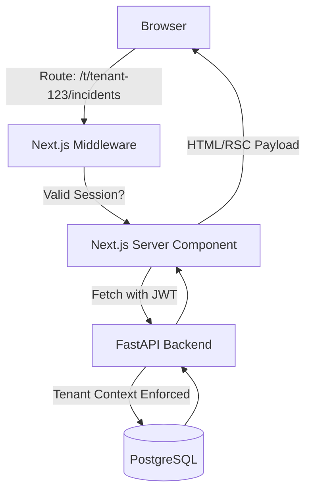

# Plan: V3 SaaS Frontend Dashboard

**Created:** 2026-07-02
**Target repo:** `.` (SentinelDB)
**Origin:** `docs/brainstorms/2026-07-02-frontend-dashboard-v3-saas-requirements.md`

## Problem Frame
SentinelDB's V3 backend now supports true multi-tenancy, JWT-based authentication, and mocked billing integration. The existing `frontend/` directory is a basic React+Vite SPA built during V1C. We need to replace it with a production-grade SaaS frontend using Next.js (App Router), enabling secure Server Components (BFF), path-based tenant isolation (`/t/[tenantId]`), and an onboarding flow.

## Requirements
- Replace the existing React+Vite app with a Next.js (App Router) application.
- Implement path-based tenant isolation (`/t/[tenantId]`) to ensure all incident links are inherently tenant-aware and easily shareable.
- Secure data fetching using React Server Components, passing the Supabase JWT to the FastAPI backend (`AUTH_ENFORCED=true`).
- Implement the V3 SaaS onboarding wizard (Sign Up -> Mock Billing -> Register DB).
- Build the core incident monitoring screens (Live Feed, Report View, Evidence Panel, Historical Incidents, Manual Trigger).
- Deliver a premium UI utilizing advanced design system practices (e.g., bento grids, minimalism).

## Key Technical Decisions
- **Next.js App Router (BFF):** We will use Next.js Server Components to act as a secure Backend-for-Frontend (BFF). This hides the backend FastAPI endpoints and authentication tokens from the browser.
- **Middleware-based Routing:** Next.js middleware will enforce authentication and ensure users cannot access `/t/[tenantId]` routes if they do not belong to that tenant or lack a valid JWT session.
- **Supabase SSR Auth:** We will use `@supabase/ssr` to manage cookies securely on the server-side rather than relying strictly on the client-side `supabase-js` client.
- **Tailwind CSS & shadcn/ui:** To achieve a premium, non-templated look, we will establish a strong design system foundation using Tailwind CSS and selectively import shadcn/ui components.

## High-Level Technical Design

## Scope Boundaries

### Deferred to Follow-Up Work
- Real Stripe checkout integration (using mock status for now).
- Multi-user RBAC within a single tenant (assume one admin user per tenant for V3 MVP).
- Real-time WebSockets for incident updates (polling or manual refresh is acceptable for V3 MVP).

### Outside this product's identity
- Direct execution of SQL queries from the dashboard.
- Modifying database infrastructure or configurations from the UI.

---

## Implementation Units

### U1. Initialize Next.js Application & Architecture Setup
**Goal:** Replace the existing Vite frontend with a fresh Next.js App Router project and establish the design system foundation.
**Dependencies:** None
**Files:**
- `frontend/package.json` (Delete/Replace)
- `frontend/vite.config.ts` (Delete)
- `frontend/next.config.mjs` (Create)
- `frontend/src/app/layout.tsx`
- `frontend/src/app/page.tsx`
- `frontend/tailwind.config.ts`
**Approach:** Delete the existing React+Vite files and generate a new Next.js project inside `frontend/`. Configure Tailwind CSS, install `@supabase/ssr` for auth, and set up the global CSS for a premium look (glassmorphism/minimalism).
**Test scenarios:**
- Verify the Next.js dev server starts successfully.
- Verify global Tailwind styles apply correctly.

### U2. Authentication & Tenant Middleware
**Goal:** Implement Supabase SSR authentication and Next.js middleware to protect routes.
**Dependencies:** U1
**Files:**
- `frontend/src/middleware.ts`
- `frontend/src/utils/supabase/server.ts`
- `frontend/src/app/(auth)/login/page.tsx`
- `frontend/src/app/(auth)/signup/page.tsx`
**Approach:** Create the Supabase server-side clients to manage cookies. Implement `middleware.ts` to redirect unauthenticated users to `/login`, validate tenant access when navigating to `/t/[tenantId]`, and securely refresh expired session cookies. Enable strict CSRF protection for all Server Actions.
**Test scenarios:**
- Attempting to access `/t/123` unauthenticated redirects to `/login`.
- Successful login sets cookies and redirects to onboarding or default tenant dashboard.
- Submitting invalid credentials shows an error state.

### U3. V3 Onboarding & Billing Mock Flow
**Goal:** Create a setup wizard for new users to create their tenant and register a database.
**Dependencies:** U2
**Files:**
- `frontend/src/app/onboarding/page.tsx`
- `frontend/src/app/onboarding/layout.tsx`
- `frontend/src/components/forms/register-db.tsx`
**Approach:** Build a multi-step UI where users: 1) See their mock billing plan confirmed, 2) Create a tenant name, 3) Input their DB connection strings (which are sent to the FastAPI `Instance Registry` endpoints).
**Test scenarios:**
- Completing the onboarding wizard successfully creates a tenant and redirects to `/t/[newTenantId]/dashboard`.
- Skipping required fields displays validation errors.

### U4. Core Dashboard Shell & Navigation
**Goal:** Build the primary tenant layout with a sidebar and tenant switcher.
**Dependencies:** U2
**Files:**
- `frontend/src/app/t/[tenantId]/layout.tsx`
- `frontend/src/components/navigation/sidebar.tsx`
- `frontend/src/components/navigation/tenant-switcher.tsx`
**Approach:** Implement a responsive dashboard shell. The `tenantId` is extracted from the route params in `layout.tsx` and used to fetch tenant details. The `tenant-switcher` allows users to navigate between multiple tenants they own.
**Test scenarios:**
- Sidebar links correctly append the current `tenantId` (e.g. `/t/123/incidents`).
- Switching tenants via the dropdown changes the URL and re-fetches data for the new tenant.

### U5. Incident Management Screens
**Goal:** Build the Live Incident Feed, Report View, and Evidence Panel.
**Dependencies:** U4
**Files:**
- `frontend/src/app/t/[tenantId]/incidents/page.tsx`
- `frontend/src/app/t/[tenantId]/incidents/[incidentId]/page.tsx`
- `frontend/src/components/incidents/evidence-panel.tsx`
- `frontend/src/components/incidents/rca-summary.tsx`
**Approach:** Use Server Components to securely fetch incident data from the FastAPI backend using the authenticated Supabase JWT. Render the deterministic RCA report into clear, scannable sections (Root Cause, Why This Is Most Likely, Runbook, Safe Next Actions). The Evidence Panel will use a responsive drawer component (side-panel on desktop, bottom-sheet on mobile) to ensure on-call DBEs can read charts without horizontal scrolling.
**Test scenarios:**
- Navigating to the incident list fetches and displays incidents for the active tenant.
- Clicking an incident opens the detailed report view.
- Expanding the evidence panel shows raw metric values and charts.
- API fetch failure displays a graceful error state (ErrorBoundary).

### U6. Settings & Manual Trigger
**Goal:** Implement the customer-facing settings and manual incident analysis trigger.
**Dependencies:** U4
**Files:**
- `frontend/src/app/t/[tenantId]/settings/page.tsx`
- `frontend/src/components/forms/manual-trigger.tsx`
**Approach:** Provide a UI to view registered DB instances and mock billing status. Build a form component that allows DBEs to select an instance, alert focus, and time window, sending a `POST` request to the FastAPI manual trigger endpoint.
**Test scenarios:**
- Submitting the manual trigger form successfully starts an analysis job and shows a toast notification.
- Settings page correctly displays the tenant's registered DB instances.
